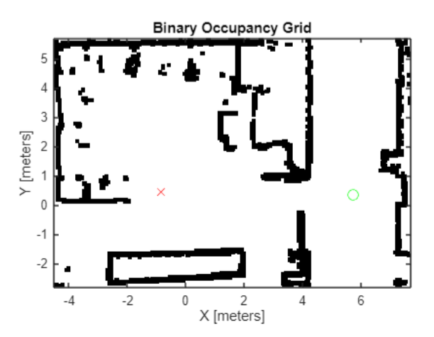
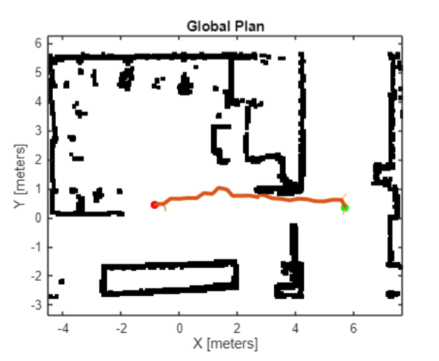
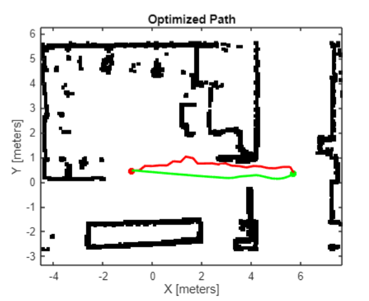
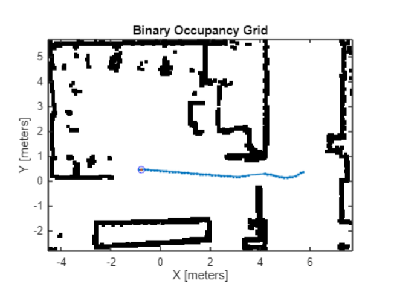

# Mobile Robotics Navigation

ROS 2 and MATLAB implementation of an autonomous TurtleBot3 navigation pipeline developed during my master's work in mobile robotics. The project combines sampling-based global planning, path optimization, and Time Elastic Band (TEB) path following in a Gazebo/RViz simulation environment.

## Project Overview

The repository contains two connected parts:

- `matlab/`: MATLAB Robotics System Toolbox workflow for receiving robot odometry and RViz goals, generating a global plan, optimizing the path, and publishing velocity commands.
- `ros2_ws/`: TurtleBot3/Nav2/Gazebo assets for the indoor map, custom world, and launch files used to run the simulation and localization stack.

## Features

- ROS 2 MATLAB node setup with `/odom`, `/goal_pose`, and `/cmd_vel` integration.
- Occupancy-map based path planning with PRM, RRT, and BiRRT variants.
- Path optimization before trajectory tracking.
- TEB local planner for velocity command generation and obstacle-aware path following.
- Gazebo world, model, and Nav2 map assets for the indoor environment.

## Environment

The navigation stack is configured around the included indoor occupancy map:


## Results

The figures below show the main stages produced by the MATLAB navigation pipeline.

| Scenario setup | BiRRT global plan |
| --- | --- |
|  |  |

| Optimized path | TEB tracking path |
| --- | --- |
|  |  |

## Repository Layout

```text
.
|-- media/
|   |-- scenario_start_goal.png
|   |-- birrt_global_plan.png
|   |-- optimized_path.png
|   `-- teb_tracking_path.png
|-- matlab/
|   |-- turtlebot3_navigation.m
|   |-- +mobile_robotics/
|   |-- PoseHandle.m
|   `-- indoor_map.pgm
|-- ros2_ws/
|   `-- src/
|       |-- turtlebot3/
|       |   `-- turtlebot3_navigation2/
|       |       |-- launch/
|       |       `-- map/
|       `-- turtlebot3_simulations/
|           `-- turtlebot3_gazebo/
|               |-- launch/
|               |-- models/
|               `-- worlds/
|-- docs/
|   |-- project_report.rst
|   `-- project_report.pdf
`-- NOTICE.md
```

## Requirements

- ROS 2 with TurtleBot3, Nav2, Gazebo, and RViz packages available.
- MATLAB with Robotics System Toolbox and Navigation Toolbox.
- TurtleBot3 model environment variable, for example:

```bash
export TURTLEBOT3_MODEL=burger
```

## Running The Simulation

These files are ROS package additions for an existing TurtleBot3/Nav2 workspace. Copy or symlink the contents of `ros2_ws/src/` into the matching upstream TurtleBot3 package folders, then build and source your workspace:

```bash
cd <your-existing-ros2-workspace>
colcon build --symlink-install
source install/setup.bash
```

Launch the indoor Gazebo world:

```bash
ros2 launch turtlebot3_gazebo turtlebot3_indoor.launch.py
```

Launch Nav2 localization with the custom map:

```bash
ros2 launch turtlebot3_navigation2 navigation2_indoor.launch.py use_sim_time:=true
```

Run `matlab/turtlebot3_navigation.m` from MATLAB after ROS 2 discovery is configured. This is the main project script; helper functions live under `matlab/+mobile_robotics/`.

## Notes

This project originated from robotics project work and was cleaned up for portfolio use. Upstream TurtleBot3/Nav2 launch files retain their original notices and licenses. See `NOTICE.md` for attribution details.
